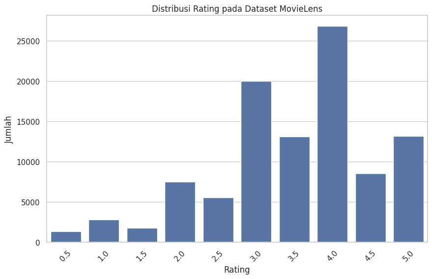
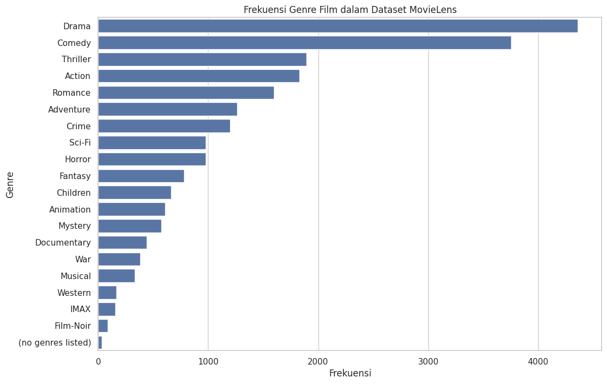
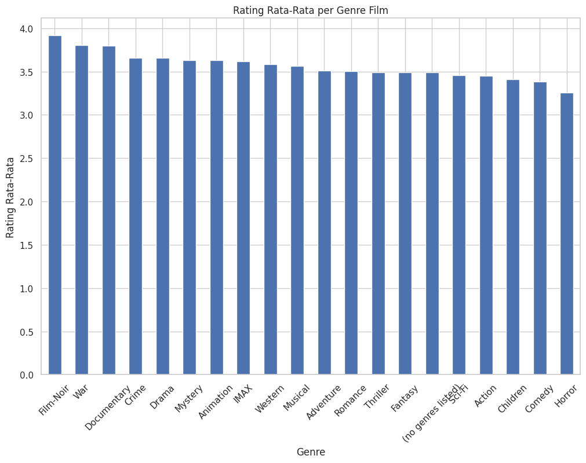
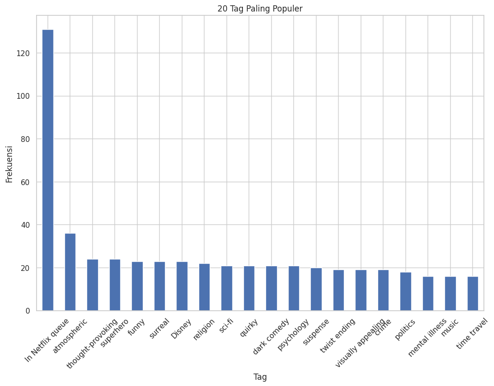
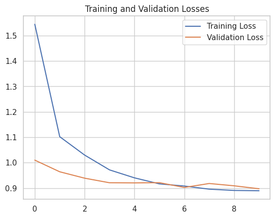

# Laporan Proyek Machine Learning
oleh Hilmiyatul Asna

## Pendahuluan

Dalam era digital, sistem rekomendasi telah menjadi elemen penting dalam meningkatkan keterlibatan pengguna dan personalisasi layanan di berbagai platform online. Keberhasilan rekomendasi yang relevan dan personal sangat ditentukan oleh efektivitas algoritma yang digunakan. Dua pendekatan utama yang sering dibahas dalam penelitian adalah *content-based filtering* dan *collaborative filtering*.  

Pendekatan *content-based filtering* berfokus pada atribut atau karakteristik item, di mana sistem merekomendasikan item yang mirip dengan yang sudah disukai oleh pengguna sebelumnya. Sebaliknya, *collaborative filtering* memanfaatkan preferensi pengguna lain, dengan asumsi bahwa individu dengan kesukaan yang serupa cenderung menyukai item yang sama.  

Dalam studi ini, dataset MovieLens, yang berisi kumpulan besar penilaian dan tag film, digunakan sebagai studi kasus untuk mengevaluasi dan membandingkan efektivitas kedua metode tersebut. Dataset ini memberikan peluang untuk menilai tidak hanya akurasi rekomendasi, tetapi juga kemampuan sistem dalam mengatasi tantangan seperti masalah *cold start* dan *sparsity*. Penelitian ini memiliki signifikansi karena dapat membantu meningkatkan pengalaman pengguna di berbagai platform, memastikan konten yang direkomendasikan relevan dengan preferensi pengguna.  

Penelitian sebelumnya menunjukkan berbagai teknik dan metode yang telah dikembangkan untuk meningkatkan performa sistem rekomendasi, namun masih terdapat ruang untuk pengembangan lebih lanjut. Tantangan seperti personalisasi yang lebih baik, penanganan data yang tidak lengkap, dan peningkatan skala sistem masih memerlukan solusi inovatif.  

Proyek ini bertujuan untuk mengeksplorasi secara mendalam keunggulan dan kelemahan *content-based filtering* dibandingkan dengan *collaborative filtering* menggunakan dataset MovieLens sebagai studi kasus. Dengan membandingkan kedua pendekatan dalam skenario nyata, penelitian ini diharapkan dapat memberikan kontribusi signifikan dalam merancang sistem rekomendasi yang lebih akurat, personal, dan mampu mengatasi berbagai kendala yang ada di bidang ini.

## Business Understanding

# Business Understanding

## Problem Statements
Dalam proyek ini, masalah utama yang ingin dipecahkan adalah:
1. Apa saja faktor yang mempengaruhi efektivitas model rekomendasi pada dataset MovieLens?
2. Bagaimana cara membangun model content-based filtering dan collaborative filtering untuk merekomendasikan film yang relevan kepada pengguna?
3. Bagaimana cara meningkatkan kualitas rekomendasi yang dihasilkan dari kedua pendekatan tersebut?

## Goals
Tujuan utama dari proyek ini adalah untuk menjawab masalah-masalah di atas melalui langkah-langkah berikut:
1. Mengidentifikasi dan menganalisis faktor-faktor yang mempengaruhi efektivitas kedua metode rekomendasi pada dataset MovieLens.
2. Membangun model content-based filtering dan collaborative filtering untuk memberikan rekomendasi film yang relevan bagi pengguna.
3. Meningkatkan kualitas rekomendasi dengan membandingkan dan mengoptimalkan kedua pendekatan tersebut.

## Solution Approach
Untuk mencapai tujuan ini, solusi yang diusulkan melibatkan langkah-langkah berikut:
1. Melakukan analisis eksploratif data (EDA) untuk memahami distribusi rating dan karakteristik film dalam dataset MovieLens.
2. Menerapkan content-based filtering dengan memanfaatkan fitur konten film seperti genre dan tag.
3. Menerapkan collaborative filtering dengan memanfaatkan data rating yang diberikan oleh pengguna.

# Data Understanding

Dataset yang digunakan dalam proyek ini adalah **MovieLens**, yang mencakup 100.836 rating dan 3.683 tag dari 9.742 film yang diberikan oleh 610 pengguna selama periode 29 Maret 1996 hingga 24 September 2018. Dataset ini dapat diunduh di [MovieLens Dataset](https://grouplens.org/datasets/movielens/).

Dataset ini terdiri dari beberapa file, yaitu:
- `ratings.csv`: userId, movieId, rating, timestamp
- `tags.csv`: userId, movieId, tag, timestamp
- `movies.csv`: movieId, title, genres
- `links.csv`: movieId, imdbId, tmdbId

## **Analisis Univariate dan Multivariate**

### **Statistik Rating**
Tabel berikut menunjukkan statistik deskriptif untuk rating dalam dataset:

| Jenis        | Nilai       |
|--------------|-------------|
| count        | 100836.000000 |
| mean         | 3.501557     |
| std          | 1.042529     |
| min          | 0.500000     |
| 25%          | 3.000000     |
| 50% (Median) | 3.500000     |
| 75%          | 4.000000     |
| max          | 5.000000     |
| modus        | 4.000000     |

Berikut adalah interpretasi dari statistik rating:
- **Jumlah Rating**: 100.836
- **Rata-Rata (Mean)**: 3.5016
- **Standar Deviasi**: 1.0425
- **Nilai Minimum**: 0.5
- **Kuartil Pertama (25%)**: 3.0
- **Median (50%)**: 3.5
- **Kuartil Ketiga (75%)**: 4.0
- **Nilai Maksimum**: 5.0
- **Modus**: 4.0

Dari data ini, dapat disimpulkan bahwa sebagian besar pengguna memberikan rating tinggi, dengan rata-rata sekitar 3.5 dan modus pada nilai 4.0. Distribusi rating menunjukkan adanya kecenderungan pengguna untuk memberikan rating positif, dengan sedikit kecenderungan ke arah rating yang lebih tinggi.

## Data Understanding

### **Distribusi Rating**

**Gambar 1. Distribusi rating**

Visualisasi pada Gambar 1 menunjukkan distribusi rating pada dataset MovieLens. Dari grafik tersebut, terlihat bahwa rating 4.0 adalah yang paling sering diberikan, sesuai dengan nilai modus yang telah dihitung sebelumnya. Rating 3.0 dan 4.0 mendominasi distribusi, mengindikasikan bahwa sebagian besar film menerima rating positif dari pengguna. Distribusi rating ini menunjukkan kecenderungan pengguna untuk memberikan rating yang lebih tinggi, dengan jumlah rating rendah (seperti 0.5 dan 1.0) jauh lebih sedikit dibandingkan dengan rating tinggi.

### **Frekuensi Genre Film**

**Gambar 2. Frekuensi genre film**

Visualisasi pada Gambar 2 menunjukkan frekuensi genre film dalam dataset MovieLens:
- **Drama** adalah genre paling populer, diikuti oleh **Comedy** dan **Thriller**, mencerminkan preferensi pengguna terhadap film dengan cerita mendalam atau yang menghibur.
- Genre seperti **Action**, **Romance**, dan **Adventure** juga cukup populer, menandakan ketertarikan pengguna pada film dengan narasi kuat atau elemen petualangan.
- Di sisi lain, genre seperti **Film-Noir** dan **IMAX** memiliki frekuensi lebih rendah, menunjukkan bahwa genre ini lebih jarang atau lebih spesifik dibandingkan dengan genre utama lainnya.
- Genre **(no genres listed)** menunjukkan bahwa beberapa film dalam dataset tidak memiliki genre yang terdaftar.

### **Korelasi Rating dan Genre Film**

**Gambar 3. Korelasi rating dan genre film**

Visualisasi dan analisis rating rata-rata per genre film pada Gambar 3 menunjukkan:
- **Film-Noir**, **War**, dan **Documentary** adalah genre dengan rating rata-rata tertinggi, menunjukkan bahwa film dalam genre ini cenderung sangat dihargai oleh pengguna.
- Sebaliknya, **Comedy** dan **Horror** memiliki rating rata-rata yang lebih rendah meskipun perbedaan antar genre tidak terlalu signifikan.
- **Drama** dan **Crime**, dua genre paling populer berdasarkan frekuensi, juga memiliki rating rata-rata yang cukup tinggi, menegaskan popularitas dan apresiasi mereka di kalangan pengguna.
- Genre **(no genres listed)**, meskipun memiliki jumlah film yang relatif sedikit, menunjukkan rating rata-rata yang sebanding dengan genre populer lainnya.

### **Tag Paling Populer**

**Gambar 4. Tag paling populer**

Visualisasi dan daftar 20 tag paling populer pada Gambar 4 menunjukkan:
- **In Netflix queue** adalah tag paling populer, menunjukkan ketertarikan pengguna untuk menandai film yang ingin mereka tonton di Netflix.
- Tag seperti **atmospheric**, **thought-provoking**, dan **superhero** juga populer, mencerminkan apresiasi pengguna terhadap suasana film, konten yang memicu pemikiran, dan genre superhero.
- Tag seperti **Disney**, **surreal**, dan **funny** menunjukkan ketertarikan pengguna pada film dengan elemen fantasi, humor, atau yang diproduksi oleh Disney.
- Tag seperti **religion**, **sci-fi**, **crime**, dan **politics** mencerminkan minat pengguna pada tema-tema spesifik dalam film.

### **Film Paling Populer**

**Tabel 2. Film Paling Populer**

| Judul Film                                             | Jumlah Rating | Rata-rata Rating |
|--------------------------------------------------------|---------------|------------------|
| Forrest Gump (1994)                                    | 329           | 4.16             |
| Shawshank Redemption, The (1994)                        | 317           | 4.43             |
| Pulp Fiction (1994)                                    | 307           | 4.20             |
| Silence of the Lambs, The (1991)                       | 279           | 4.16             |
| Matrix, The (1999)                                     | 278           | 4.19             |
| Star Wars: Episode IV - A New Hope (1977)               | 251           | 4.23             |
| Jurassic Park (1993)                                   | 238           | 3.75             |
| Braveheart (1995)                                      | 237           | 4.03             |
| Terminator 2: Judgment Day (1991)                       | 224           | 3.97             |
| Schindler's List (1993)                                | 220           | 4.23             |

## Data Preparation

Tahapan data preparation dalam eksperimen sistem rekomendasi menggunakan dataset MovieLens pada proyek ini mencakup langkah-langkah berikut untuk mempersiapkan dan memproses data sesuai kebutuhan analisis dan pemodelan:

1. **Menggabungkan Data Movies dengan Tags**  
   Data dari tabel `movies` dan `tags` digabungkan berdasarkan `movieId`. Untuk film yang tidak memiliki tag, nilai NaN pada kolom tag digantikan dengan string kosong. Penggabungan ini bertujuan untuk memperkaya informasi setiap film dengan detail tambahan dari tag, sehingga memungkinkan sistem rekomendasi berbasis konten untuk lebih akurat dalam menilai kesamaan antar film berdasarkan konten dan preferensi pengguna.

2. **Membuat Kolom Combined Features**  
   Kolom `combined_features` dibuat dengan menggabungkan informasi dari kolom `genres` dan `tag`, menggunakan tanda `|` sebagai pemisah. Tujuannya adalah untuk memudahkan pembuatan vektor fitur dari teks untuk analisis kesamaan, yang sangat penting dalam sistem rekomendasi berbasis konten. Hal ini membantu model dalam memahami dan membandingkan kompleksitas konten film dengan lebih efektif.

3. **Encoding untuk Collaborative Filtering**  
   `userId` dan `movieId` diubah menjadi urutan angka berurutan menggunakan `.astype('category').cat.codes`. Proses ini juga mencakup pembuatan pemetaan ulang antara kode kategori dengan ID asli. Encoding ini menyederhanakan data dan mengurangi kompleksitas komputasional, memungkinkan algoritma collaborative filtering untuk lebih efisien dalam memproses data. Ini sangat penting untuk teknik embedding yang digunakan dalam model collaborative filtering, yang membutuhkan input numerik.

4. **Pembagian Data untuk Training dan Validasi**  
   Data dibagi menjadi set pelatihan dan validasi menggunakan `train_test_split`, dengan proporsi tertentu dialokasikan untuk validasi. Pembagian ini memastikan bahwa model dapat diuji pada data yang belum pernah dilihat sebelumnya, yang berguna untuk mengukur kemampuan model dalam memprediksi rating dengan akurat pada situasi nyata dan mengidentifikasi serta mengatasi overfitting.

Setiap tahapan data preparation ini bertujuan untuk memastikan bahwa data yang digunakan dalam pemodelan sistem rekomendasi bersih, konsisten, dan siap untuk analisis lebih lanjut. Langkah-langkah ini dirancang untuk memaksimalkan efektivitas model rekomendasi, baik dalam pendekatan berbasis konten maupun collaborative filtering.

## Modeling and Result

### **Model**
Dalam eksperimen ini, dua model sistem rekomendasi dibuat untuk menangani permasalahan rekomendasi film kepada pengguna: Content-Based Filtering dan Collaborative Filtering.

1. **Content-Based Filtering**
    - **Pembuatan Model**: Menggunakan TF-IDF Vectorizer untuk mengonversi `combined_features` menjadi matriks fitur dan menghitung cosine similarity antara film-film berdasarkan matriks tersebut. Sistem kemudian merekomendasikan film yang memiliki kesamaan konten tertinggi dengan film yang disukai pengguna.
    - **Output**: Top-N rekomendasi disajikan berdasarkan skor kesamaan tertinggi.
    - **Kelebihan**:
        - Rekomendasi sangat personal dan relevan dengan preferensi spesifik pengguna berdasarkan konten.
        - Sistem tetap efektif meskipun jumlah pengguna terbatas.
    - **Kekurangan**:
        - Terbatas pada konten yang mirip dengan yang sudah diketahui; dapat menghasilkan rekomendasi yang monoton.
        - Tidak mempertimbangkan pendapat atau preferensi pengguna lain, yang bisa membatasi keragaman rekomendasi.

2. **Collaborative Filtering**
    - **Pembuatan Model**: Menggunakan teknik Deep Learning dengan TensorFlow dan Keras untuk membangun model yang memprediksi rating film berdasarkan histori interaksi antara pengguna dan film. Model memanfaatkan struktur embedding untuk pengguna dan film, serta menggunakan input dari `userId` dan `movieId`.
    - **Output**: Sistem merekomendasikan Top-N film yang belum ditonton oleh pengguna berdasarkan prediksi rating tertinggi.
    - **Kelebihan**:
        - Mampu mengidentifikasi pola dan preferensi tersembunyi yang mungkin tidak terlihat dalam konten film itu sendiri, menawarkan rekomendasi yang lebih beragam.
        - Dapat meningkat dengan penambahan data; semakin banyak interaksi yang dianalisis, semakin akurat rekomendasinya.
    - **Kekurangan**:
        - Memerlukan data yang cukup besar untuk pelatihan model agar efektif, yang dikenal sebagai masalah cold start.
        - Kompleksitas komputasi lebih tinggi dibandingkan content-based filtering, membutuhkan sumber daya komputasi yang lebih besar.

Kedua pendekatan memiliki tempatnya masing-masing dalam ekosistem rekomendasi. Pemilihan antara keduanya bergantung pada konteks aplikasi dan ketersediaan data:
- **Content-Based Filtering** lebih cocok untuk aplikasi dengan konten yang sangat spesifik dan personalisasi mendalam sangat penting, atau ketika informasi tentang preferensi pengguna lebih mudah diakses daripada data interaksi pengguna lain.
- **Collaborative Filtering** cocok untuk platform dengan banyak pengguna dan interaksi, di mana pola besar tersebut dapat dimanfaatkan untuk menghasilkan rekomendasi yang relevan dan beragam.

Dalam praktiknya, kombinasi keduanya sering kali memberikan hasil terbaik, menggabungkan kekuatan kedua pendekatan untuk mencapai rekomendasi yang personal, relevan, dan beragam.

### **Result**

#### **Top-N Rekomendasi Content-Based Filtering**
- **Judul Film**: Cocoanuts, The (1929)
- **Genre**: Comedy|Musical
- **Tag**: 
- **Nilai Precision**: 1

## Top-N Rekomendasi

### **Content-Based Filtering**

Tabel 3. Top-N Rekomendasi Content-Based Filtering:
| No  | Judul Film                                      | Tahun | Genre          | Skor Kesamaan |
|-----|-------------------------------------------------|-------|----------------|---------------|
| 1   | Band Wagon, The (1953)                          | 1953  | Comedy|Musical | 1.0           |
| 2   | Great Race, The (1965)                          | 1965  | Comedy|Musical | 1.0           |
| 3   | History of the World: Part I (1981)             | 1981  | Comedy|Musical | 1.0           |
| 4   | Help! (1965)                                    | 1965  | Comedy|Musical | 1.0           |
| 5   | Holiday Inn (1942)                              | 1942  | Comedy|Musical | 1.0           |
| 6   | Anchors Aweigh (1945)                           | 1945  | Comedy|Musical | 1.0           |
| 7   | Beach Blanket Bingo (1965)                      | 1965  | Comedy|Musical | 1.0           |
| 8   | Can't Stop the Music (1980)                     | 1980  | Comedy|Musical | 1.0           |
| 9   | À nous la liberté (Freedom for Us) (1931)       | 1931  | Comedy|Musical | 1.0           |
| 10  | Girls! Girls! Girls! (1962)                     | 1962  | Comedy|Musical | 1.0           |

### **Collaborative Filtering**

**User ID**: 584

Tabel 4. Top-N Rekomendasi Collaborative Filtering:
| No  | Judul Film                                          |
|-----|-----------------------------------------------------|
| 1   | Perez Family, The (1995)                           |
| 2   | Last Supper, The (1995)                            |
| 3   | Wallace & Gromit: The Best of Aardman Animation    |
| 4   | Iron Giant, The (1999)                             |
| 5   | South Pacific (1958)                               |

## Evaluation

### **Content-Based Filtering Evaluation**

Untuk model Content-Based Filtering, metrik **precision** digunakan untuk mengukur proporsi rekomendasi yang relevan dibandingkan dengan jumlah total rekomendasi yang diberikan. Formula untuk precision adalah:

### **Collaborative Filtering Evaluation**

Untuk model Collaborative Filtering yang menggunakan TensorFlow dan Keras, **Mean Squared Error (MSE)** adalah metrik utama yang digunakan untuk mengukur akurasi prediksi model terhadap rating yang sebenarnya. MSE memberikan gambaran tentang seberapa besar kesalahan prediksi model dalam mengestimasi rating film, dengan fokus pada pengurangan kesalahan sepanjang proses pelatihan dan validasi.

MSE dihitung dengan rumus berikut:

%5E2)

Selama pelatihan, model dijalankan melalui beberapa epoch, di mana setiap epoch mencakup satu siklus melalui seluruh dataset pelatihan. RMSE dihitung untuk setiap batch data sebagai indikator kinerja model. Model bertujuan untuk meminimalkan RMSE dengan menyesuaikan bobot menggunakan backpropagation dan optimasi gradient descent. Hasil pelatihan divisualisasikan dalam grafik yang menunjukkan perubahan Training Loss dan Validation Loss, menggambarkan perbandingan RMSE selama pelatihan dan validasi. Grafik ini memberikan gambaran tentang:

- **Peningkatan Akurasi Prediksi**: Penurunan RMSE menunjukkan bahwa model semakin baik dalam memprediksi rating.
- **Deteksi Overfitting**: Jika Validation Loss meningkat sementara Training Loss terus menurun, ini menandakan model overfitting dan performa pada data validasi mulai menurun.

Gambar 5. Visualisasi metrik training dan loss validasi

### **Kesimpulan**

Hasil evaluasi untuk model Content-Based Filtering menunjukkan nilai precision sempurna (1), yang berarti semua rekomendasi relevan. Meskipun ini menunjukkan keberhasilan model, potensi bias dalam evaluasi atau kurangnya variasi dalam skenario pengujian perlu dipertimbangkan.

Sementara itu, model Collaborative Filtering yang dievaluasi dengan MSE menunjukkan penurunan konsisten dalam training loss dan validation loss, yang menunjukkan peningkatan kemampuan prediktif model. Penurunan ini berakhir stabil, tanpa divergensi antara keduanya, menunjukkan bahwa model menghindari overfitting, tantangan umum dalam sistem rekomendasi.

Loss validasi yang mendekati loss pelatihan menunjukkan bahwa model dapat menggeneralisasi data dengan baik, seperti yang terlihat pada dataset validasi.

Secara keseluruhan, proyek ini berhasil membangun dan mengevaluasi model rekomendasi berbasis Content-Based Filtering dan Collaborative Filtering menggunakan dataset MovieLens. Hasil analisis eksploratif membantu dalam pembuatan fitur dan pemahaman konten yang relevan dengan preferensi pengguna. Kedua model menunjukkan kemampuan dalam merekomendasikan film yang relevan kepada pengguna, dengan Content-Based Filtering efektif untuk film dengan konten serupa dan Collaborative Filtering mengidentifikasi film berdasarkan pola rating dari banyak pengguna.

## Daftar Referensi
[[1]] Orue-Saiz, M. Rico-González, J. Pino-Ortega, and A. Méndez-Zorrilla, "Improving diet through a recommendation system using physical activity data and healthy diet indexes of female futsal players," Proceedings of the Institution of Mechanical Engineers, Part P: Journal of Sports Engineering and Technology, vol. 0, no. 0, 2024. 
[[2]] R.N. Ravikumar, S. Jain, and M. Sarkar, "AdaptiLearn: real-time personalized course recommendation system using whale optimized recurrent neural network," Int J Syst Assur Eng Manag, 2024. 
[[3]] H. Imantho, K. B. Seminar, E. Damayanthi, N. E. Suyatma, K. Priandana, B. W. Ligar, and A. U. Seminar, "An Intelligent Food Recommendation System for Dine-in Customers with Non-Communicable Diseases History," Jurnal Keteknikan Pertanian, vol. 12, no. 1, pp. 140-152, 2024. 
[[4]] M. KabirMamdouh, Alireza, and A. Gürhan Kök, "A Personalized Content-Based Method to Predict Customers’ Preferences in an Online Apparel Retailer." SSRN, 2024. 
[[5]] D. Leela Krishna Reddy and H. Vaghela, "Music Recommendation System Using Machine Learning," EasyChair Preprint no. 12850, Mar. 31, 2024. 
[[6]] M. Surya Negara and A. Z. M., "Implementasi Machine Learning dengan Metode Collaborative Filtering dan Content-Based Filtering pada Aplikasi Mobile Travel (Bangkit Academy)," in JBegaTI, vol. 5, no. 1, Mar. 2024, pp. 126-136.

   [1]: <https://journals.sagepub.com/doi/abs/10.1177/17543371241241847>
   [2]: <https://link.springer.com/article/10.1007/s13198-024-02301-2>
   [3]: <https://jurnalpenyuluhan.ipb.ac.id/index.php/jtep/article/view/52452>
   [4]: <https://papers.ssrn.com/sol3/papers.cfm?abstract_id=4782004>
   [5]: <https://easychair.org/publications/preprint_download/qr7B>
   [6]: <http://begawe.unram.ac.id/index.php/JBTI/article/view/1193>
   [MovieLens]: <://grouplens.org/datasets/movielens/>
